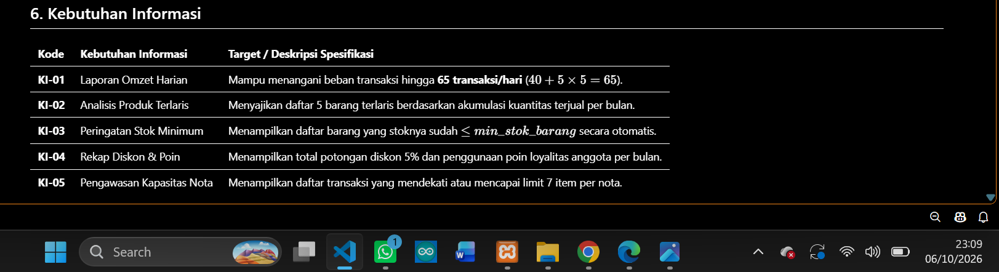

# p02_laporan_104.md

**Nama :** Dea Novita  
**NIM:** 25430104  
**Kode Akhiran NIM:** 104  
**Tanggal:** 6 Oktober 2026  
**Modul:** 02 - Analisis Kebutuhan Data Koperasi Mahasiswa (Kopma)  

## 1. Latar Belakang dan Aktivitas Organisasi

Koperasi Mahasiswa (Kopma) merupakan unit kegiatan mahasiswa yang menjalankan usaha toko ritel untuk memenuhi kebutuhan civitas akademika kampus. Aktivitas utama Kopma meliputi pendaftaran dan pengelolaan data anggota, penjualan barang harian di pertokoan, pemesanan serta penerimaan barang dari pemasok, dan penyusunan laporan operasional harian hingga bulanan. Untuk menjaga kualitas pelayanan dan transparansi, Kopma membutuhkan sistem basis data terstruktur yang mampu mencatat transaksi secara real-time, mengontrol stok barang, dan mengelola hak keanggotaan (diskon dan poin) secara akurat.

## 2. Aktor dan Proses Bisnis

| Kode | Proses Bisnis | Aktor | Pemicu |
| :--- | :--- | :--- | :--- |
| **PB-01** | Mendaftarkan Anggota | Kasir / Administrasi | Mahasiswa mengajukan pendaftaran anggota baru |
| **PB-02** | Mencatat Penjualan | Kasir | Pembeli melakukan pembayaran barang di kasir |
| **PB-03** | Memesan Barang ke Pemasok | Petugas Gudang | Stok barang mencapai atau di bawah batas minimum |
| **PB-04** | Menerima Barang dari Pemasok | Petugas Gudang | Barang pesanan tiba di lokasi bersama faktur |
| **PB-05** | Menyusun Laporan Bulanan | Ketua Koperasi | Periode awal bulan baru |
| **PB-06** | Mengelola Data Pemasok | Petugas Gudang / Administrasi | Ada penambahan pemasok baru atau pembaruan kontak |

## 3. Dokumen Sumber yang Dianalisis

1. **Formulir Pendaftaran Anggota:** Berisi identitas mahasiswa (NIM, Nama, Prodi, No. HP).
2. **Struk / Nota Penjualan:** Berisi nomor nota, tanggal, kasir yang bertugas, rincian barang, harga per unit, diskon, dan total bayar.
3. **Faktur Pembelian / Surat Jalan:** Berisi nomor faktur, data pemasok, rincian barang masuk, harga beli, dan total tagihan.
4. **Kartu Stok Barang:** Berisi catatan rekap fisik mutasi barang masuk dan keluar di gudang.

## 4. Entitas Kandidat dan Elemen Data

1. **Anggota**
   * Atribut: `no_anggota` (PK), `nim_anggota`, `nama_anggota`, `prodi_anggota`, `no_hp_anggota`, `status_aktif_anggota`, `poin_anggota`
2. **Barang**
   * Atribut: `kode_barang` (PK), `nama_barang`, `kategori_barang`, `harga_jual_barang`, `stok_barang`, `min_stok_barang`
3. **Penjualan**
   * Atribut: `no_nota_penjualan` (PK), `tgl_penjualan`, `kode_petugas` (FK), `no_anggota` (FK, Nullable), `total_bayar`, `poin_diperoleh`, `poin_ditukar`
4. **Detail Penjualan**
   * Atribut: `no_nota_penjualan` (FK), `kode_barang` (FK), `qty_detail_penjualan`, `harga_satuan_detail_penjualan`
5. **Petugas**
   * Atribut: `kode_petugas` (PK), `nama_petugas`, `peran_petugas`
6. **Pemasok**
   * Atribut: `kode_pemasok` (PK), `nama_pemasok`, `telepon_pemasok`, `alamat_pemasok`
7. **Pembelian**
   * Atribut: `no_faktur_pembelian` (PK), `tgl_pembelian`, `kode_pemasok` (FK), `total_pembelian`
8. **Detail Pembelian**
   * Atribut: `no_faktur_pembelian` (FK), `kode_barang` (FK), `qty_detail_pembelian`, `harga_beli_detail_pembelian`

## 5. Aturan Bisnis

| Kode | Nama Aturan Bisnis | Deskripsi dan Formula (NIM 104) |
| :--- | :--- | :--- |
| **AB-01** | Batas Item Transaksi | Satu nota penjualan dapat menampung maksimal **7 item barang** yang berbeda ($P + 2 = 5 + 2 = 7$). |
| **AB-02** | Diskon Anggota | Anggota aktif berhak mendapatkan diskon sebesar **5%** ($P = 5\%$) dari total transaksi belanja. |
| **AB-03** | Validasi Stok | Transaksi ditolak jika $qty > stok\_barang$. Stok barang tidak boleh bernilai negatif. |
| **AB-04** | Harga Historis | `harga_satuan_detail_penjualan` mencatat harga saat transaksi terjadi agar rekapitulasi nota lama tetap konsisten meskipun harga utama naik. |
| **AB-05** | Ambang Restock | Pesanan otomatis disiapkan oleh Petugas Gudang jika $stok\_barang \le min\_stok\_barang$. |
| **AB-06** | Keunikan Identity | Atribut `nim_anggota` dan `no_anggota` bersifat unik per mahasiswa. |
| **AB-07** | Poin Loyalitas | Setiap kelipatan transaksi Rp10.000 bagi anggota aktif berhak mendapatkan 1 poin. |

## 6. Kebutuhan Informasi

| Kode | Kebutuhan Informasi | Target / Deskripsi Spesifikasi |
| :--- | :--- | :--- |
| **KI-01** | Laporan Omzet Harian | Mampu menangani beban transaksi hingga **65 transaksi/hari** ($40 + 5 \times 5 = 65$). |
| **KI-02** | Analisis Produk Terlaris | Menyajikan daftar 5 barang terlaris berdasarkan akumulasi kuantitas terjual per bulan. |
| **KI-03** | Peringatan Stok Minimum | Menampilkan daftar barang yang stoknya sudah $\le min\_stok\_barang$ secara otomatis. |
| **KI-04** | Rekap Diskon & Poin | Menampilkan total potongan diskon 5% dan penggunaan poin loyalitas anggota per bulan. |
| **KI-05** | Pengawasan Kapasitas Nota | Menampilkan daftar transaksi yang mendekati atau mencapai limit 7 item per nota. |

## 7. Matriks CRUD

| Kode Proses | Nama Proses Bisnis | Anggota | Barang | Penjualan | Detail Penjualan | Pemasok | Pembelian | Detail Pembelian |
| :--- | :--- | :---: | :---: | :---: | :---: | :---: | :---: | :---: |
| **PB-01** | Mendaftarkan Anggota | C | | | | | | |
| **PB-02** | Mencatat Penjualan | U (poin) | R, U (stok) | C | C | | | |
| **PB-03** | Memesan Barang ke Pemasok | | R | | | R | C | C |
| **PB-04** | Menerima Barang dari Pemasok | | U (stok) | | | R | U | U |
| **PB-05** | Menyusun Laporan Bulanan | R | R | R | R | | R | R |
| **PB-06** | Mengelola Data Pemasok | | | | | C, U, D | | |

*Keterangan: C = Create, R = Read, U = Update, D = Delete*

## 8. Kamus Data Awal

| Elemen Data | Deskripsi | Tipe Data | Contoh Nilai | Aturan Bisnis / Constraint | Penanggung Jawab (*Data Steward*) |
| :--- | :--- | :--- | :--- | :--- | :--- |
| `no_anggota` | Nomor identitas unik anggota Kopma | String | A-0104 | Format A-4digit, Unik | Ketua Koperasi |
| `nim_anggota` | Nomor Induk Mahasiswa | String | 2301010104 | Unik, 10 digit | Ketua Koperasi |
| `no_hp_anggota` | Nomor telepon anggota | String | 081234567890 | Terproteksi, R terbatas | Ketua Koperasi |
| `no_nota_penjualan` | Kode bukti transaksi penjualan | String | PJ-2610-0104 | Unik per transaksi | Kasir |
| `harga_satuan_detail_penjualan` | Harga jual aktual per item transaksi | Integer | 5000 | Nominal Rupiah $\ge 0$, AB-04 | Kasir |
| `stok_barang` | Jumlah stok fisik barang di toko | Integer | 45 | Integer $\ge 0$, AB-03 | Petugas Gudang |
| `poin_anggota` | Total akumulasi poin belanja | Integer | 120 | Integer $\ge 0$, AB-07 | Ketua Koperasi |

## 9. Kebutuhan Non-Fungsional Data

* **Volume Data:** Didesain untuk memproses volume rata-rata 65 transaksi harian dengan kapasitas hingga 20.000 entri transaksi per tahun.
* **Retensi Data:** Seluruh berkas transaksi penjualan dan pembelian disimpan minimal selama 5 tahun untuk pemeriksaan audit keuangan tahunan.
* **Privasi dan Keamanan:** Data kontak pribadi seperti `no_hp_anggota` terenkripsi dan hanya dapat diakses oleh Ketua Koperasi; Kasir hanya mendapat akses verifikasi status keaktifan anggota.

## 10. Isu Kualitas Data yang Diantisipasi

1. **Pencegahan Anomali Harga Historis:** Memisahkan atribut harga barang di master tabel dengan detail nota agar perubahan harga master tidak mengubah catatan nilai omzet nota terdahulu.
2. **Anomali Entri Ganda (*Duplicate Entry*):** Mengaktifkan *constraint UNIQUE* pada `nim_anggota` dan `kode_pemasok`.
3. **Inkonsistensi Stok Barang:** Menggunakan transaksi atomik (*Atomic Transaction*) saat penyimpanan kasir agar stok langsung terpotong secara tepat saat pembayaran terkonfirmasi.

## 11. Bukti Tangkapan Layar (GitHub)

- [x] **Bukti Tangkapan Layar:** Tabel PB, AB, KI, matriks CRUD, dan kamus data di berkas proyek (tangkapan tampilan GitHub).

,(<>)(<>)(<>)(<>)